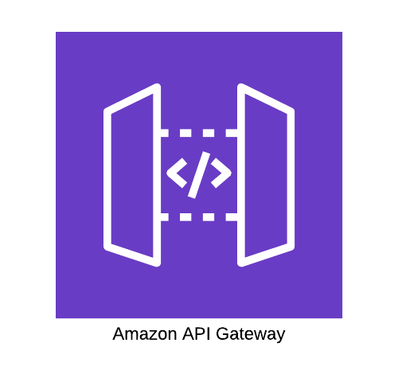
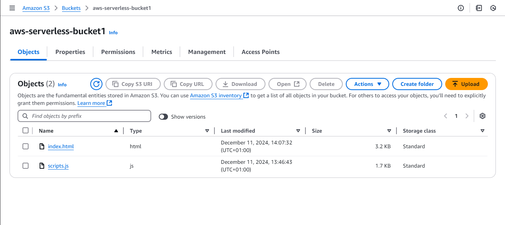
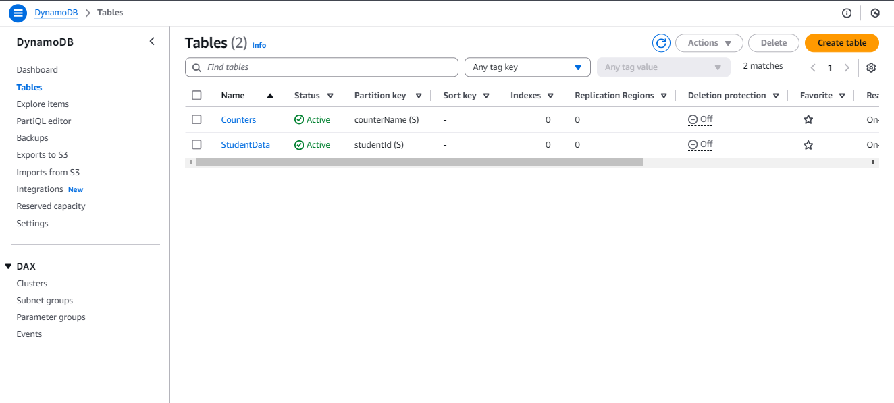

# System Architecture

## Overview

### Global Architecture Diagram
The system's architecture demonstrates the flow of data between components, as illustrated in the diagram below:

### Components
- **Frontend:** Hosted on AWS S3 and delivered through Amazon CloudFront. CloudFront caches static content (HTML, CSS, JavaScript, etc.) at edge locations, ensuring faster load times and improved global performance.
- **API Gateway:** Manages incoming HTTP requests.
- **Lambda:** Executes business logic and interacts with DynamoDB.
- **DynamoDB:** Efficiently stores and retrieves application data.

---

## Explanation of the Main Components

### Frontend
The frontend consists of static files (HTML, CSS, JavaScript) hosted in an S3 bucket and delivered through Amazon CloudFront for global accessibility. 

- **S3:** Hosts the application files.
- **CloudFront:** Distributes static content globally, caching it at edge locations to reduce latency and improve load times for users. 

#### Benefits:
- Automatic scalability.
- Cost efficiency, with charges based on storage and data transfer.
- Faster access for global users due to reduced latency.

---

### API Gateway
The API Gateway serves as the entry point for HTTP requests from the frontend.

- **Purpose:** Routes requests to Lambda functions based on HTTP methods (GET, POST, PUT, DELETE).

#### Benefits:
- Provides secure communication.
- Includes request validation and monitoring features.

---

### Lambda
Lambda functions handle the application's backend logic.

- **Role:** Executes tasks such as validating inputs and interacting with DynamoDB.
- **Trigger:** Invoked by requests routed through the API Gateway.

#### Benefits:
- Pay-per-use model.
- Automatic scaling and high availability.

---

### DynamoDB
DynamoDB is a NoSQL database used for storing and retrieving application data.

- **Role:** Efficiently stores application data, such as student records.

#### Features:
- High throughput and low latency for large datasets.
- Automatic scaling and encryption at rest for security.

---

## Role of Each Component

### S3 and CloudFront: Hosting the Application
- S3 stores the static files (HTML, CSS, JavaScript).
- CloudFront ensures high availability and low latency by caching static content globally and serving it to users efficiently.

#### Benefits:
- Reduces latency and speeds up global content delivery.

---

### API Gateway: Managing HTTP Requests
- Acts as the interface between the frontend and backend.
- Routes requests to Lambda functions based on HTTP methods.

#### Benefits:
- Enhances security and monitoring for HTTP communications.

---

### Lambda: Executing Backend Code
- Executes application logic, triggered by API Gateway requests.

#### Benefits:
- Cost-effective with a pay-per-use model.
- Automatically scales based on workload.

---

### DynamoDB: Storing Data
- Provides a scalable solution for storing application data.

#### Features:
- High performance with low latency.
- Built-in security through encryption.

---

### 3. AWS Configuration
This section details the steps to configure the necessary AWS services for this project: S3, API Gateway, Lambda, and DynamoDB.

#### 3.1 Steps to Configure S3 (Static Hosting)
1. Log in to the AWS Management Console.
2. Navigate to S3 and create a new bucket.
3. Upload the HTML and JavaScript files to the bucket.
4. Enable the static hosting option for the bucket.
5. Configure the bucket to be publicly accessible so that the application can be accessed via a URL.

*Figure 1: Bucket S3*

*Figure 2: Enable Web Hosting in Bucket S3*

*Figure 3: Bucket Policy*

#### 3.2 Steps to Configure CloudFront
1. Log in to the AWS Management Console and navigate to CloudFront.
2. Click on **Create Distribution**.
3. Under the **Origin Settings**, select the S3 bucket created earlier as the origin.
4. Enable **Origin Access Control (OAC)** to secure the connection between CloudFront and the S3 bucket.
5. Specify the default root object, such as `index.html`, so CloudFront knows which file to serve.
6. Modify the S3 bucket policy to allow CloudFront access by including the CloudFront service principal (`cloudfront.amazonaws.com`) in the policy.
7. Block all public access to the S3 bucket to prevent direct exposure.
8. Click on **Create Distribution** and wait for the distribution to deploy (this may take several minutes).
9. Once the deployment is complete, use the CloudFront-provided secure **HTTPS URL** to access your application.

*Figure 4: CloudFront Distribution*

*Figure 5: Resource Origins*

#### 3.3 Creating APIs with API Gateway
1. Navigate to API Gateway and create a new REST API.
2. Define resources and methods (GET, POST) to interact with the Lambda functions.
3. Link each API method to its corresponding Lambda function.
4. Configure permissions so that only authorized requests can access the API.

*Figure 6: Create REST API*

*Figure 7: API Resources*

*Figure 8: Example Get Resource*

#### 3.4 Deploying Lambda Functions
1. Go to AWS Lambda and create two functions: one for GET and one for POST.
2. Add the necessary permissions for Lambda functions to access DynamoDB.
3. Deploy the Lambda functions to make them accessible via API Gateway.

*Figure 9: Lambda Functions*

*Figure 10: GET Function*

*Figure 11: POST Function*

*Figure 12: Permissions Lambda*

*Figure 13: IAM Role*

#### 3.5 Configuring DynamoDB (Table and Data Schema)
1. Create a table in DynamoDB with `student_id` as the primary key.
2. Define a flexible schema to store student information (e.g., age, class).

*Figure 14: DynamoDB Tables*

*Figure 15: Explore Items*

### 4. Data Flow
This section describes the data flow from the user submitting a request to storing it in DynamoDB.

#### 4.1 Step-by-Step Explanation of a User Request
When a user submits a form to add a student:

1. **Request Submission:** The user submits a form on the frontend (delivered via CloudFront, which serves the static website from the S3 bucket).
2. **API Request Sent:** The frontend sends an HTTP POST request to the API Gateway with the student's data.
3. **Processing by Lambda:** API Gateway invokes the POST Lambda function.
4. **Storage in DynamoDB:** The Lambda function saves the data in DynamoDB.
5. **Response to User:** Lambda sends a response to the API Gateway, which relays it to the frontend, confirming successful data storage. The response is displayed securely to the user via CloudFront.

